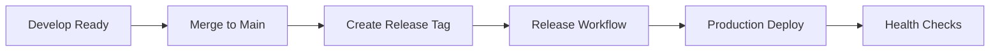

# 🚀 GitHub Actions Workflows - PINOVARA

Pipelines CI/CD automatizados para o projeto PINOVARA, incluindo build, testes, deploy e manutenção.

## 🔄 Workflows Disponíveis

### 1. 🚀 **CI/CD Pipeline** (`ci-cd-pipeline.yml`)
**Pipeline principal para integração e deploy contínuo**

**Triggers:**
- Push para `main` ou `develop`
- Pull requests para `main`

**Jobs:**
1. **Quality Checks** - Lint e validações
2. **Backend Tests** - Testes do servidor Node.js
3. **Frontend Tests** - Testes da aplicação React
4. **Build Production** - Gerar build otimizado
5. **Docker Build** - Criar imagens Docker
6. **Deploy Staging** - Deploy automático para staging (branch `develop`)
7. **Deploy Production** - Deploy automático para produção (branch `main`)
8. **Notification** - Notificações de deployment

### 2. 🔍 **Pull Request Validation** (`pull-request.yml`)
**Validação automática de pull requests**

**Triggers:**
- Abertura de PR
- Atualização de PR
- Reopen de PR

**Jobs:**
1. **PR Validation** - Verificações gerais
2. **Security Scan** - Varredura de segurança
3. **Dependency Check** - Análise de dependências
4. **Performance Check** - Impacto na performance

**Features:**
- ✅ Análise de tamanho do PR
- ✅ Detecção de breaking changes
- ✅ Comentários automáticos com resumo
- ✅ Verificação de segurança

### 3. 🎉 **Release Management** (`release.yml`)
**Gerenciamento de releases e deploys**

**Triggers:**
- Publicação de release no GitHub
- Execução manual (workflow_dispatch)

**Jobs:**
1. **Validate Release** - Validar versão e gerar changelog
2. **Build Release** - Build com tags de versão
3. **Docker Release** - Imagens Docker taggeadas
4. **Deploy Release** - Deploy da release
5. **Release Notification** - Notificações de release

**Features:**
- ✅ Versionamento semântico
- ✅ Changelog automático
- ✅ Tags Docker por versão
- ✅ Deploy controlado por ambiente

### 4. 🔧 **Maintenance & Monitoring** (`maintenance.yml`)
**Manutenção automática e monitoramento**

**Triggers:**
- Diário às 2h UTC
- Semanal aos domingos às 3h UTC
- Execução manual

**Jobs:**
1. **Dependency Update** - Verificar atualizações
2. **Security Scan** - Varredura de vulnerabilidades
3. **Performance Check** - Análise de performance
4. **Cleanup** - Limpeza de artefatos
5. **Health Check** - Verificação de saúde dos sistemas

## 🔐 Secrets Necessários

Configure os seguintes secrets no repositório:

### **GitHub Packages (GHCR)**
- `GITHUB_TOKEN` - Token automático (já disponível)

### **Deploy Secrets (opcional)**
```
PRODUCTION_SSH_KEY     # Chave SSH para servidor de produção
PRODUCTION_HOST        # IP/hostname do servidor
STAGING_SSH_KEY        # Chave SSH para servidor de staging
STAGING_HOST           # IP/hostname do staging
DB_PASSWORD           # Senha do banco de produção
```

### **Notification Secrets (opcional)**
```
SLACK_WEBHOOK         # Webhook do Slack para notificações
EMAIL_SERVICE_KEY     # Chave do serviço de email
DISCORD_WEBHOOK       # Webhook do Discord
```

## 🌍 Ambientes de Deploy

### **Staging Environment**
- **URL:** https://staging.pinovaraufba.com.br
- **Trigger:** Push para branch `develop`
- **Auto-deploy:** ✅ Habilitado
- **Approval:** ❌ Não requerida

### **Production Environment**
- **URL:** https://pinovaraufba.com.br
- **Trigger:** Push para branch `main` ou release
- **Auto-deploy:** ✅ Habilitado
- **Approval:** ⚠️ Configurável (recomendado)

## 📦 Artefatos Gerados

### **Build Artifacts**
- `production-build-{sha}` - Build completo de produção
- `release-build-{version}` - Build taggeado por versão

### **Reports**
- `dependency-report-{run}` - Relatório de dependências
- `security-report-{run}` - Relatório de segurança
- `performance-report-{run}` - Relatório de performance
- `health-report-{run}` - Relatório de saúde

### **Docker Images**
- `ghcr.io/{owner}/{repo}/pinovara-backend:latest`
- `ghcr.io/{owner}/{repo}/pinovara-nginx:latest`
- `ghcr.io/{owner}/{repo}/pinovara-backend:{version}`
- `ghcr.io/{owner}/{repo}/pinovara-nginx:{version}`

## 🔄 Fluxo de Desenvolvimento

### **Feature Development**


### **Release Process**


## ⚙️ Configuração de Branches

### **Branch Protection Rules**

#### **Main Branch**
- ✅ Require PR reviews (2 reviewers)
- ✅ Require status checks
- ✅ Require branches to be up to date
- ✅ Restrict pushes to specific roles
- ✅ Require signed commits (opcional)

#### **Develop Branch**
- ✅ Require PR reviews (1 reviewer)
- ✅ Require status checks
- ✅ Allow force pushes for maintainers

### **Required Status Checks**
- `quality-checks`
- `backend-tests`
- `frontend-tests`

## 🚨 Monitoramento e Alertas

### **Build Failures**
- ❌ Notificação imediata
- 📧 Email para maintainers
- 💬 Slack/Discord (se configurado)

### **Deploy Status**
- 🟢 Deploy bem-sucedido
- 🟡 Deploy com warnings
- 🔴 Deploy falhado + rollback

### **Security Alerts**
- 🔒 Vulnerabilidades críticas
- 📊 Relatórios semanais
- 🔄 Atualizações automáticas (minor versions)

## 🛠️ Customização

### **Adicionando Novos Ambientes**
1. Criar environment no GitHub
2. Adicionar secrets específicos
3. Atualizar workflows com novo ambiente
4. Configurar approval rules

### **Modificando Deploy Strategy**
1. Editar `ci-cd-pipeline.yml`
2. Ajustar jobs de deploy
3. Atualizar health checks
4. Testar em staging primeiro

### **Adicionando Testes**
1. Criar scripts de teste
2. Atualizar jobs de teste nos workflows
3. Configurar coverage reports
4. Integrar com status checks

## 📊 Métricas de CI/CD

### **Performance Típica**
- **Build Time:** ~3-5 minutos
- **Test Suite:** ~2-3 minutos
- **Deploy Time:** ~1-2 minutos
- **Total Pipeline:** ~6-10 minutos

### **Success Rates**
- **CI Pipeline:** >95% success rate
- **Deploy Success:** >98% success rate
- **Rollback Time:** <2 minutos

## 🆘 Troubleshooting

### **Build Failures**
1. Check logs nos workflow runs
2. Verificar dependencies e cache
3. Testar localmente primeiro
4. Revisar recent changes

### **Deploy Failures**
1. Verificar secrets e permissions
2. Check server resources
3. Validar network connectivity
4. Review deployment logs

### **Test Failures**
1. Run tests locally
2. Check test dependencies
3. Verify test data/fixtures
4. Review environment differences

## 📞 Suporte

Para problemas com CI/CD:

1. ✅ Check workflow runs no GitHub Actions
2. ✅ Review logs detalhados
3. ✅ Verificar status de secrets e environments
4. ✅ Testar mudanças em feature branch primeiro

---

**🚀 Automated deployment pipeline for professional development!**